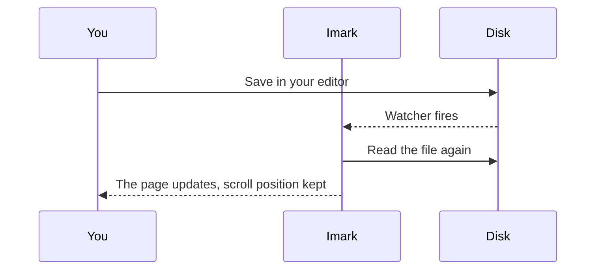

# Everything at once

This file exists to be opened, not to be read. It carries every construction the
renderer knows, and enough headings that the outline folds itself. If something
breaks, it breaks here first.

## Text

Prose is set in a column capped at 72 characters, because a line you have to
track back across is a line you read twice. **Bold** and *italic* and
***both at once***, `inline code`, ~~struck through~~, and ==marked== text all
sit on the same baseline without pushing the line apart.

A second paragraph, so there is something else on the page. The word *anchor*
appears here, and the word anchor appears again in this same sentence.

### Links

An [external link](https://example.com) opens in your browser. A
[local one](./showcase.md) opens in the same window, with back and forward
history.

### Quotes

> A blockquote is a top-level block.
>
> > And it can contain another one, which should indent without the border
> > doubling up into a smear.

## Code

Syntax colours come from the same palette as the rest of the app, rather than an
imported highlight.js theme that would glow in a page it knows nothing about.

```swift
/// The one thing in Imark that writes to your files, so it goes through a
/// temporary file and a rename rather than writing over the original.
private static func write(_ text: String, to url: URL) throws {
    let folder = url.deletingLastPathComponent()
    let temporary = folder.appendingPathComponent(".\(url.lastPathComponent).imark-\(UUID().uuidString)")
    try text.write(to: temporary, atomically: false, encoding: .utf8)
    do {
        _ = try FileManager.default.replaceItemAt(url, withItemAt: temporary)
    } catch {
        try? FileManager.default.removeItem(at: temporary)
        throw error
    }
}
```

```javascript
// A licence file is somebody else's markdown and may contain fences of its own.
const fenced = (text) => {
  const longest = Math.max(2, ...[...text.matchAll(/`+/g)].map((m) => m[0].length))
  const fence = '`'.repeat(longest + 1)
  return `${fence}\n${text}\n${fence}`
}
```

```bash
IMARK_SIGN_IDENTITY="Developer ID Application: Name (TEAMID)" IMARK_NOTARY_PROFILE=imark ./release.sh
```

```
A fence with no language at all. It should still get the frame, the copy button
and the monospaced face, just no colours.
```

## Diagrams

Mermaid renders locally and takes its colours from the same variables as
everything else, so diagrams do not glow white in the middle of a dark page.



## Tables

| Piece | Where it lives | Notes |
|---|---|---|
| Line map | `renderer/src/main.js` | `data-line` on every block |
| Live reload | `Sources/Imark/FileWatcher.swift` | Survives an atomic save |
| Outline | `Sources/Imark/SidebarViewController.swift` | Folds past twenty entries |

A wider one, to check that it scrolls inside its own box rather than pushing the
whole page sideways:

| Command | Shortcut | What it does | When it is greyed out | Since |
|---|---|---|---|---|
| Find | `⌘F` | Highlights every hit, with a counter | Never | 0.1 |
| Bigger / Smaller Text | `⌘+` / `⌘-` | Changes the text size | Never | 0.1 |
| Toggle Sidebar | `⌘\` | Shows or hides the outline | Never | 0.1 |
| Reload | `⌘R` | Reads the file again | Never | 0.1 |
| Back / Forward | `⌘[` / `⌘]` | Steps through local-link history | No history in that direction | 0.1 |

## Lists

Unordered, with a nested level:

- The first item
- The second, which is longer so it wraps and you can see how the hanging indent
  behaves when a line runs past the end
  - A nested item
  - Another one
    - And a third level, because someone always does
- The last

Ordered:

1. Ask the certificate holder
2. Make the repository public
3. Cut a release with the `.dmg` attached
4. Record the fifteen seconds that are the whole post
5. Publish in three places on the same day

Tasks, which are clickable:

- [x] Line map with `data-line`
- [x] Collapsible outline
- [x] Live reload
- [x] Local links
- [ ] A Developer ID certificate
- [ ] Somebody else's Mac

## Mathematics

Inline maths like $e^{i\pi} + 1 = 0$ sits in the line without disturbing it.

Display maths gets its own block:

$$
\text{minutes}(w) = \max\left(1, \text{round}\left(\frac{w}{220}\right)\right)
$$

That one is real: it is the reading-time estimate in the status bar, at 220
words a minute.

An equation may also be broken over as many lines as it takes to stay readable,
and the subscripts in it are subscripts rather than italics:

$$ \mathbf{K}_e^L = \mathbf{K}_m^L
+ \mathbf{K}_b^L $$

And a dollar sign on its own is money: the licence costs $0 and always will.

## Definition lists

Orphan
: A note whose quoted words are no longer in the document. Still visible, still
  attached to its block, marked as having lost its anchor.

Occurrence
: Which copy of a repeated phrase a note is about, written as `nth=`.

Atomic save
: Write to a temporary file in the same directory, then rename it over the
  original. Never write over the original in place.

## Footnotes

Comments are stored in HTML comments[^why], which every markdown renderer hides
and every text editor shows.

[^why]: A sidecar file would not travel with the document, and a syntax of our
own would dirty files that other tools read.

## Images

Images beside the document load through a private URL scheme, so a page never
gets handed `file://` access to your disk:

<p align="center">
  
</p>

Remote images deliberately do not load.

## Horizontal rules

---

Three dashes make a rule, and it should be a hairline rather than a bar.

## Long enough to scroll

### One

Enough sections follow that the outline in the sidebar opens folded.

### Two

Each of these is deliberately short. What matters is how many there are.

### Three

The active heading in the sidebar should still track the scroll position
accurately even with this many short sections in a row.

### Four

Past twenty entries the sidebar opens folded, so a changelog reads as one row
per version instead of four hundred rows of prose.

### Five

### Six

### Seven

### Eight

### Nine

### Ten

## The end

If everything above rendered, the renderer is fine.
