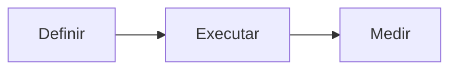

# Plano Q3

Texto de **teste** com _ênfase_ e um [link externo](https://example.com).

## Objectivos

- Aumentar receita recorrente
- Melhorar retenção
- [ ] tarefa por fazer
- [x] tarefa feita

Ligação wiki: [[notas-reuniao]] e [[exemplo|com etiqueta]].

| Coluna | Valor |
|---|---|
| a | 1 |
| b | 2 |

```swift
let prioridades = ["receita", "retencao"]
print(prioridades.count)
```



Fórmula: $E = mc^2$

> Uma citação para testar o estilo.
