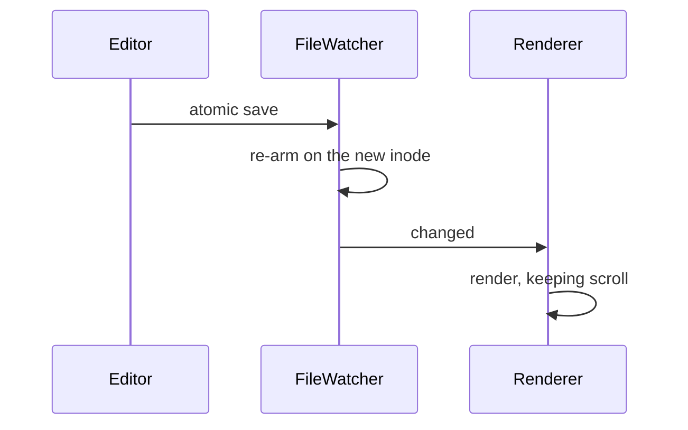

# The Markdown Field Guide

Everything Imark knows how to render, in one file. Edit it in your editor and
the view follows every save without losing your place.

## Code

Syntax colours come from the same palette as the rest of the app, so nothing
imported from a theme fights the interface.

```swift
/// Watches a single file and reports changes.
///
/// Editors rarely write in place: most do an atomic save — write a temp file,
/// then rename it over the original — which deletes the inode being watched.
func arm() {
    descriptor = open(url.path, O_EVTONLY)
    guard descriptor >= 0 else { return retryShortly() }

    let source = DispatchSource.makeFileSystemObjectSource(
        fileDescriptor: descriptor,
        eventMask: [.write, .extend, .delete, .rename],
        queue: queue
    )
    source.setEventHandler { [weak self] in self?.rearmAndNotify() }
    source.resume()
}
```

```typescript
// A bell rather than a linear ramp: the taper has no edge, so the funnel
// reads as one soft shape however fast the pointer moves.
const falloffAt = (distance: number, sigma = 1.15): number =>
  Math.exp(-(distance * distance) / (2 * sigma * sigma))

export function widthFor(level: number, distance: number): number {
  const resting = 10 + Math.max(0, 3 - level) * 3
  return resting + falloffAt(distance) * 32
}
```

```bash
open -a Imark README.md
swift Support/make-icon.swift
```

## Diagrams

Mermaid is rendered locally and takes its colours from the document theme, so
diagrams do not glow white in the middle of a dark page.




## Typography

Prose is set at **16px on a 1.7 line height**, in a column capped at *72
characters*, because a line you have to track back across is a line you read
twice. Inline `code` sits on a tinted chip, ~~struck text~~ stays legible, and
links like [daringfireball.net](https://daringfireball.net) open in your
browser rather than trapping you inside a reader.

A local link opens the file next door in the same window: [changelog](./changelog.md).

> Typography is the craft of endowing human language with a durable visual
> form. A reader should never notice it working.

## Tables

| Feature | Where it lives | Notes |
|---|---|---|
| Live reload | `FileWatcher.swift` | Debounced at 120ms |
| Outline | `SidebarViewController.swift` | Folds past 20 entries |

## Lists

Ordinary lists nest, and task lists get real checkboxes:

- Reading column capped at 72 characters
- Headings that carry their own anchors
  - Nested items keep the same rhythm
  - And the same marker colour
- Footnotes collected at the end[^1]

- [x] Render Markdown offline
- [x] Reload without losing scroll position
- [x] Preview in the Finder with the space bar
- [ ] Write the thing you actually opened the editor for

## Mathematics

KaTeX is bundled with its fonts inlined, so formulas render with no network and
no flash of unstyled type. Inline, $e^{i\pi} + 1 = 0$; and set on its own line:

$$
\int_{0}^{\infty} e^{-x^{2}}\,dx = \frac{\sqrt{\pi}}{2}
$$

## Images

Images beside the document load through a private URL scheme, so a page never
gets handed `file://` access to your disk:

<p align="center">
  
</p>

Remote images deliberately do not load. A reader that quietly phones out is not
offline, whatever the marketing says.

## Front matter

The block at the top of this file became the card above the title. Keys become
chips, arrays become comma-separated values, and nothing is dumped as raw YAML
in the middle of your prose.

## Definition lists

Atomic save
: Write a temporary file, then rename it over the original. The inode changes,
  so a naive file watcher goes deaf.

Optical centring
: Placing a shape where it *looks* centred rather than where it measures
  centred. The Imark icon sits about 1% left of true centre.

---

That is the whole vocabulary. If something renders here, it renders in your
documents.

[^1]: Footnotes are numbered automatically and linked in both directions.
